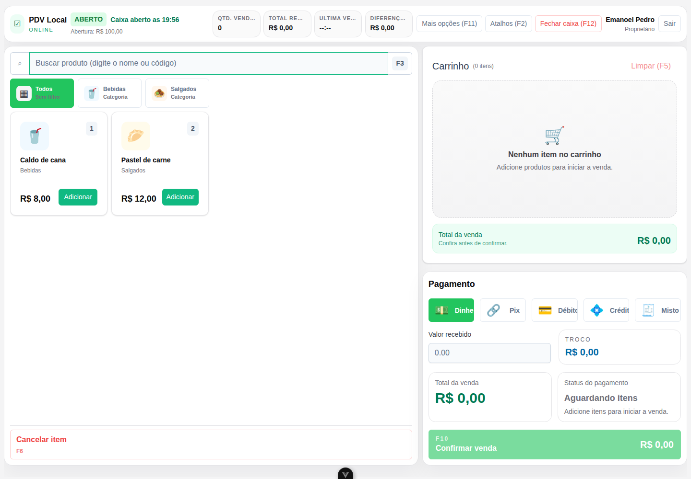

# PDV Local

[](https://github.com/EmanoelPedro/pdv-erp/actions/workflows/ci.yml)
[](LICENSE)

Sistema de ponto de venda local-first para pequenos estabelecimentos. O projeto reúne operação de caixa, catálogo, vendas, despesas e indicadores em uma aplicação que funciona localmente, sem depender de serviços externos para o fluxo principal.

Este é um projeto pessoal open source, construído para demonstrar decisões de produto, arquitetura em camadas, testes automatizados e distribuição multiplataforma.

## Interface



## Funcionalidades

- primeiro acesso com criação do proprietário e autenticação por PIN
- perfis de proprietário e funcionário
- abertura e fechamento de caixa com conferência do saldo esperado
- catálogo de categorias e produtos, incluindo fotos
- registro de vendas com dinheiro, Pix, débito, crédito ou pagamento misto
- cálculo de troco e totais por sessão de caixa
- lançamento e manutenção de despesas
- dashboard e relatórios operacionais
- persistência local em SQLite e migrações com Alembic
- interface web/PWA e aplicação desktop com Tauri

## Tecnologias

- Backend: Python 3.13+, FastAPI, SQLAlchemy, SQLite, Alembic, Pydantic, Ruff e Pytest
- Frontend: Vue 3, TypeScript, Vite, Pinia, PrimeVue, Tailwind CSS e pnpm
- Desktop: Tauri 2 e Rust

## Executar localmente

Pré-requisitos:

- Python 3.13 ou superior
- [uv](https://docs.astral.sh/uv/)
- Node.js 22 ou superior
- pnpm 10

Clone e prepare o ambiente:

```bash
git clone https://github.com/EmanoelPedro/pdv-erp.git
cd pdv-erp
cp backend/.env.example backend/.env
cp frontend/.env.example frontend/.env
pnpm --dir frontend install --frozen-lockfile
cd backend && uv sync --locked --all-groups && uv run alembic upgrade head && cd ..
```

Em dois terminais, inicie backend e frontend:

```bash
make backend-dev
```

```bash
make frontend-dev
```

A interface estará disponível em `http://127.0.0.1:5173`. No primeiro acesso, a aplicação solicita os dados e o PIN do proprietário.

## Qualidade

```bash
make lint
make test
cd frontend && pnpm format
```

O pipeline de integração contínua executa lint, verificação de formatação, testes do backend e build do frontend em cada pull request.

## Aplicação desktop

O runtime desktop inicia o backend local automaticamente e mantém banco, mídia e logs no diretório de dados da aplicação.

```bash
make desktop-dev
make desktop-build-linux
# ou, em um host Windows:
make desktop-build-windows
```

Consulte [desenvolvimento desktop](docs/desktop-development.md) para os pré-requisitos nativos e [entrega local no Linux](docs/local-linux-release.md) para a alternativa baseada em navegador.

## Arquitetura

O backend é um monólito modular dividido em API, domínio, serviços e repositórios. O frontend consome a mesma API HTTP tanto no navegador quanto no shell desktop. A visão detalhada e os principais trade-offs estão em [docs/architecture.md](docs/architecture.md).

## Limitações atuais

- a fila local de sincronização está preparada, mas ainda não existe um serviço em nuvem
- emissão fiscal e controle avançado de estoque não fazem parte do escopo
- os instaladores desktop ainda não são publicados automaticamente como releases

## Contribuição e segurança

Leia [CONTRIBUTING.md](CONTRIBUTING.md) antes de enviar uma alteração. Vulnerabilidades devem seguir o processo descrito em [SECURITY.md](SECURITY.md), sem abertura de issue pública.

## Licença

Distribuído sob a licença MIT. Consulte [LICENSE](LICENSE).
